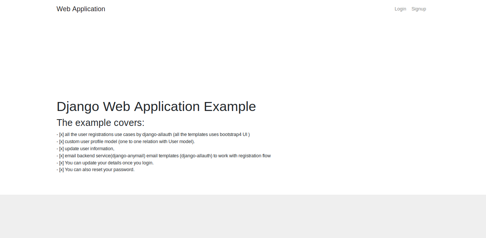
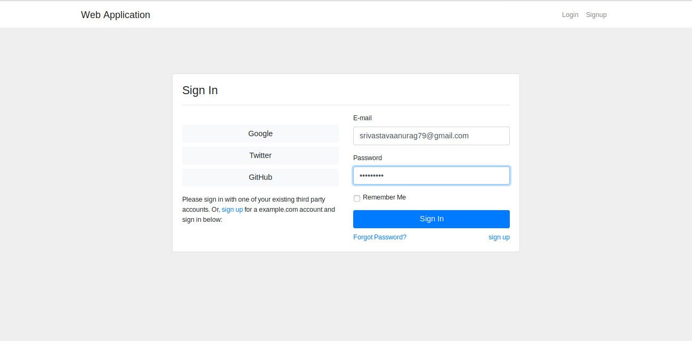
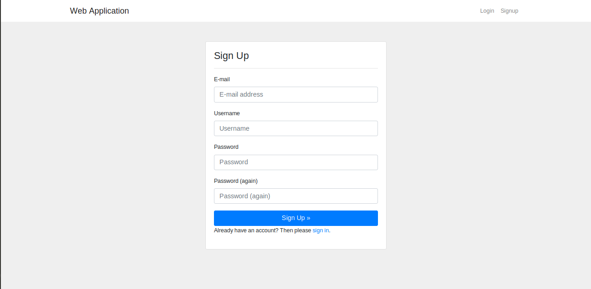
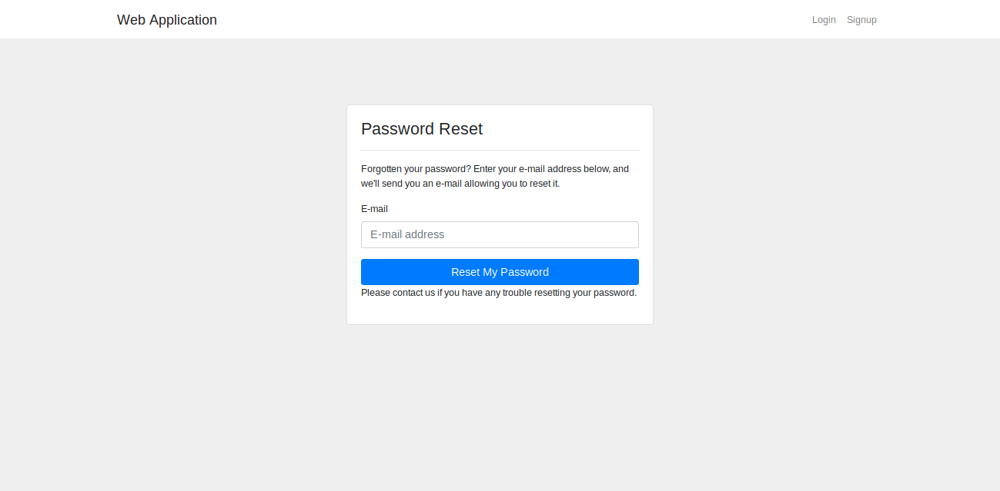
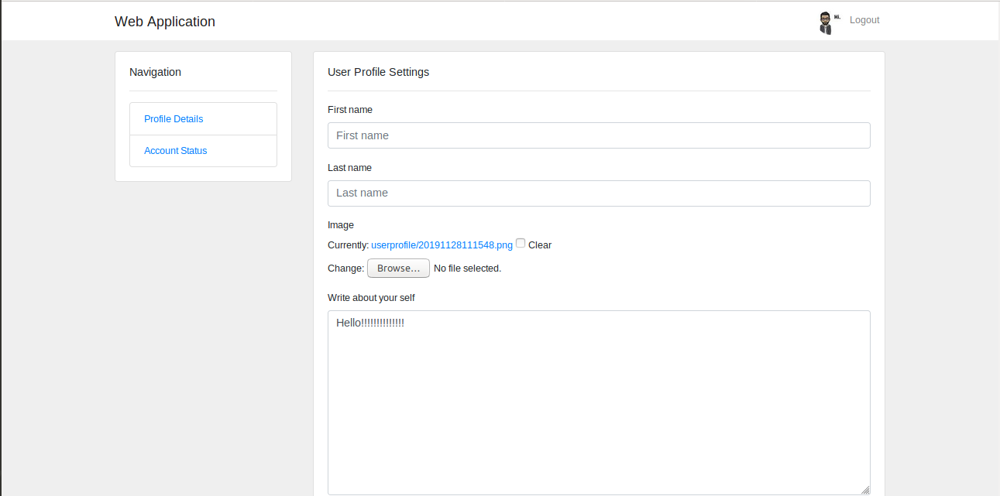

# Django Authenticating and Signing up users

This projects aims to provide a example of Django project with bootstrap 4 version of the templates for the user registration and authentication views.
We shall be able to use it as plain email based registration alone or along with social authentication.

This project uses the following amazing projects from the opensource:

- django-allauth (gives social authentication abilities and covers all the major user registration usecases.)
- django-anymail (gives ability to send emails via any famous email service provider.)
- django-bootstrap4 (gives bootstrap4 UI for the django forms)
- placeholder-pics (generating profile pictures based on name/email)
- django-thumbs-v2 (generating thumbnails of the profile pictures)

The project covers

- [x] all the user registrations use cases by django-allauth (all the templates uses bootstrap4 UI )
- [x] custom user profile model (one to one relation with User model).
- [ ] user profile settings pages
    - [x] update user information,
    - [ ] de-activate/re-activate user[TODO]
- [x] email backend service(django-anymail) email templates (django-allauth) to work with registration flow

## Screenshots


Homepage
---------


Signin Page
---------


Signup Page
---------


Password reset page
---------


User Profile page
---------


## Installation

Use the package manager [pip](https://pip.pypa.io/en/stable/) to install foobar.

-open terminal
- Change to the directory of the project and install the requirements.txt

```bash
pip3 install -r requirements.txt
```
## Usage
-Open terminal
 Change to the directory of the project ,i.e, /webapp

- Migrate the Tables from database
```bash
python3 manage.py makemigrations
```
```bash
python3 manage.py migrate
```
- create a superuser to become an admin
```bash
python3 manage.py createsuperuser
```
- run the web app
```bash
python3 manage.py runserver
```
Once the application is launched, homepage will be displayed:
- Click on Signup to register a user.
- After signing up you will be asked to confirm your email, since this is a development project you can see the link in your terminal to confirm your email, click on that link you will be redirected to the confirmation page.
- Once you are confirmed click on Login page to log into the webapp.
- Once you are logged inside you can update your profile.
- If you forget your password you can reset it too.
- You have an option to login with your social accounts too.
